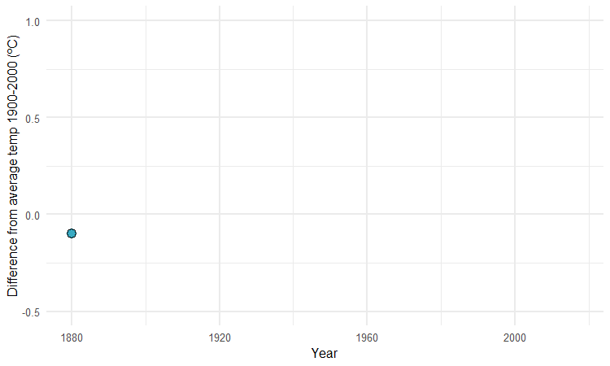

# gg_animate_tutorial
A short introduction to using the gg_animate package to animate ggplot2 plots. 

# Iteration and animation: Loops, GIFs, and videos

This script servers as an introduction for creating animated GIFs and videos from charts made in R with ggplot2, using the gganimate package. See <https://paldhous.github.io/ucb/2018/dataviz/week14.html> for full article and along with original code.
All code in this repo has been adapted from the link above.

## What does this repo contain?

The repo contains a [R Markdown file](gg_animate.rmd) for creating animated ggplot2 charts. The markdown file demonstrates how to create the three charts below:

1. **GDP per capita by life expectancy at birth, from 1990 to 2016 **
2. **A scatter plot of Difference from mean global temperature (1900-2000), from 1880 to 2017 **
3. **Simulation of global average temperature, Human vs Natural **

